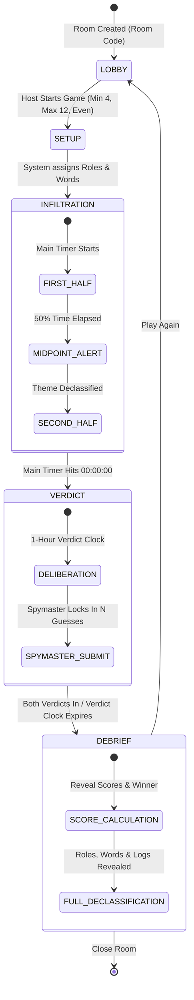

# Subterfuge: Comprehensive System & Game Specification

**Version:** 1.0.0  
**Status:** Approved Architecture Draft  
**Target Environment:** Serverless Web Application (Zero-cost hosting tier)  
**Theme:** Cold War Espionage / Classified Intelligence Dossier  

---

## 1. Executive Summary & Core Premise

**Subterfuge** is an asynchronous, high-stakes web-based social deduction game of espionage, deception, and codebreaking for **4 to 12 players** (even numbers only). 

Two opposing intelligence factions—**Red Team** and **Blue Team**—compete to uncover every secret code word stored in the global **Codebook** (a total of $N$ words, where $N$ equals the player count). Each player is secretly assigned a single thematic code word by the system. To win, a team must not only identify the enemy's code words through covert interrogation and deduction, but also earn the trust of their own teammates to collect their allied words.

Complicating matters, **Moles** are embedded within each faction: operatives who appear to belong to one team but secretly report to the opposing Spymaster. Halfway through the game, an automated intelligence intercept declassifies the **Secret Theme** governing all code words, sparking an intense deductive race leading up to the final **Verdict Phase**.

---

## 2. Team Composition & Role Distribution Matrix

The game strictly requires an **even number of players** ($N \in \{4, 6, 8, 10, 12\}$). Players are evenly split into two apparent teams: **Red Team** ($N/2$) and **Blue Team** ($N/2$).

### 2.1 Role Definitions
- **Spymaster (1 per team, always):** The operational commander. Holds the exclusive power to lock in the final $N$ verdict guesses during the Verdict Phase.
- **Embedded Mole (1 per team; 2 per team at 12 players):** Placed on Team A, appears as Team A in all rosters and team channels, but is secretly loyal to Team B. Wins only if Team B wins. Can covertly authenticate their true identity to opposing operatives.
- **Field Agent (remaining players):** Loyal operatives working to identify the opposing words and root out the traitor in their ranks.

### 2.2 Role Distribution Table

| Total Players ($N$) | Team Size ($N/2$) | Spymasters | Moles (per team) | Field Agents (per team) | Total Code Words ($N$) |
| :---: | :---: | :---: | :---: | :---: | :---: |
| **4** | 2 vs 2 | 1 Red, 1 Blue | 1 Red, 1 Blue | 0 | 4 |
| **6** | 3 vs 3 | 1 Red, 1 Blue | 1 Red, 1 Blue | 1 Red, 1 Blue | 6 |
| **8** | 4 vs 4 | 1 Red, 1 Blue | 1 Red, 1 Blue | 2 Red, 2 Blue | 8 |
| **10** | 5 vs 5 | 1 Red, 1 Blue | 1 Red, 1 Blue | 3 Red, 3 Blue | 10 |
| **12** | 6 vs 6 | 1 Red, 1 Blue | **2 Red, 2 Blue** | 3 Red, 3 Blue | 12 |

---

## 3. Thematic Word Bank & Declassification Engine

Unlike free-form noun submission, words are **system-assigned** to prevent balance issues, invalid parts of speech, or meta-gaming.

### 3.1 Word Bank Architecture
- The game maintains a curated dictionary of several thousand single-word nouns.
- Each word has rich **multi-theme metadata** tags.
  - *Example 1:* `"Barn"` $\rightarrow$ `["Dance", "Agriculture", "Architecture"]`
  - *Example 2:* `"Modern"` $\rightarrow$ `["Dance", "Art", "Philosophy"]`
  - *Example 3:* `"Waltz"` $\rightarrow$ `["Dance", "Music"]`
  - *Example 4:* `"Tractor"` $\rightarrow$ `["Agriculture", "Vehicles"]`

### 3.2 Assignment Algorithm
1. At game start, the system selects one **Primary Game Theme** at random (e.g., `"Dance"`).
2. The system queries all words containing that primary tag.
3. The system selects $N$ distinct words from this filtered pool and assigns exactly one secret word to each player.
4. Players are only shown their own assigned word. They are **not** told the primary theme at game launch.

### 3.3 Midpoint Theme Declassification
- At exactly **50% of the main game duration** (e.g., hour 12 of a 24-hour game, or hour 2 of a 4-hour game), the system issues a high-priority intelligence broadcast:
  > **[DECLASSIFIED INTERCEPT]**: Central Command has cracked enemy communications. The operational theme is confirmed to be **`DANCE`**.
- **Gameplay Impact:** Players immediately cross-reference words they have gathered. Because words share multiple themes, false words fed by deceptive moles may suddenly appear anomalous, while legitimate words can be vetted against the announced theme.

---

## 4. Covert Operations & Mole Verification Protocol

### 4.1 The Forced Screen-Share Threat Model
In competitive social deduction games, players on voice calls or in person frequently demand: *"Share your screen right now to prove you don't have a 'Mole' action button."*  
**Subterfuge mitigates this through asymmetric challenge-response styling.**

### 4.2 Targeted Challenge Handshake
1. **Targeted Initiation:** In any 1-on-1 Direct Message, an operative from the opposing team can initiate a challenge by targeting a specific individual. (This action is never broadcast to an entire team).
2. **Universal Disguise (Screen-Share Safe):**
   - The UI displays an identical, routine option in all DM headers: `"Verify Operative Credentials"`. Any player can trigger it.
   - When a challenge is sent, the receiver sees an identical security modal: `"Security Clearance Challenge Received: Submit Counter-Signature"`.
3. **Outcome Resolution:**
   - **Case A: Target is NOT a Mole for the requester:** Clicking submit immediately returns: `"Clearance Denied: Invalid Counter-Signature"`. Both players see a failed verification. If screen-sharing, teammates see a routine failed challenge.
   - **Case B: Target IS an embedded Mole for the requester:** When the true Mole clicks submit:
     - The **Mole's screen** displays a brief green toast: `"Operative Verified. Channel Secured."` which **automatically disappears after 3 seconds and leaves no persistent UI marker or log entry**.
     - The **Requester's screen** receives a permanent cryptographic receipt: `"CONFIRMED ASSET: [Player Name] is verified as an active Mole working for your team."`
   - *Requirement:* The Mole must trigger this action in private without teammates actively observing their screen during those 3 seconds.

### 4.3 Ephemeral "Burn" DMs
- To protect against forensic audits by suspicious teammates, any player in a 1-on-1 DM can click **"Burn Conversation"**.
- This wipes the local and server-side DM history between those two players, leaving a clean slate.

---

## 5. Communication Architecture

The communication system provides 4 discrete channel layers:

```
┌─────────────────────────────────────────────────────────────┐
│                    COMMUNICATION SUITE                      │
├─────────────────┬─────────────────┬─────────────────────────┤
│   Public Wire   │   Team Radios   │       Private DMs       │
│  (All Players)  │ (Apparent Team) │ (1-on-1 Between Any 2)  │
│                 │                 │                         │
│  • Propaganda   │  • Red Team     │  • Backchannel deals    │
│  • Disinfo      │  • Blue Team    │  • Mole recruitment     │
│  • Announcements│  • Moles sit in │  • "Burn" conversation  │
│                 │    apparent team│    support              │
└─────────────────┴─────────────────┴─────────────────────────┘
```

1. **Public Wire:** Broadcast channel visible to all $N$ players. Used for open announcements and deception.
2. **Red Team Radio:** Restricted strictly to players whose apparent assignment is Red Team. (The Red Mole sits here).
3. **Blue Team Radio:** Restricted strictly to players whose apparent assignment is Blue Team. (The Blue Mole sits here).
4. **1-on-1 Direct Messages:** Private, encrypted point-to-point chats between any two arbitrary operatives. Features targeted Mole verification and message burning.

---

## 6. Endgame, Verdicts & Scoring

### 6.1 The Verdict Phase
- When the Main Phase countdown reaches `00:00:00`, the game enters the **Verdict Phase**.
- **Duration:** Default is **1 Hour** (Configurable in lobby settings from 10 minutes to Unlimited).
- During this phase, all communication channels remain open for final debates.

### 6.2 Collaborative Verdict Board & Spymaster Override
- Each team has a private **Verdict Board**.
- Any team member can submit, suggest, or upvote candidate code words on this board.
- **Spymaster Lock-In:** Only the team's Spymaster has the final submission authorization button. The Spymaster curates the list and submits up to $N$ words as the team's official verdict.

### 6.3 Guess Constraints
- **Target:** Teams must guess **all $N$ words** in the global codebook.
- **Including Own Words:** A team must list their own members' words as well as the opposing team's words. Teams cannot take their own teammates for granted; if a player hides their word or feeds a fake word, the team's verdict suffers.
- **Format:** Free-text string inputs (trimmed, case-insensitive, punctuation-stripped).
- **Cap:** Exactly $N$ guesses maximum (no dictionary spamming).

### 6.4 Scoring Engine & Tiebreakers
$$\text{Score} = \text{Count of Correct Code Words}$$

- **Maximum Score:** $+N$
- **Minimum Score:** $0$
- **Guess Penalty:** Incorrect guesses award $0$ points (no negative penalty). However, because each team is strictly capped at $N$ total guesses, every incorrect guess forfeits an opportunity to identify a correct code word.
- **Victory Condition:** The team with the higher score wins.
- **Tiebreaker:** If both teams finish with identical scores, each team's Spymaster is prompted to submit a **Mole Indictment** (naming the opposing team's Mole).
  - A correct Mole guess awards $+2$ tiebreaker points.
  - If still tied, the game is declared a Draw.

---

## 7. Complete Game Lifecycle State Machine



---

## 8. Cold War / CIA Classified Dossier Visual System

### 8.1 Aesthetic & Design Guidelines
- **Palette:**
  - Background: Deep Charcoal / Carbon Black (`#0b0d10`, `#13171f`)
  - Redaction & Badges: Classified Crimson (`#8b0000`), Surveillance Blue (`#1a365d`)
  - Accents: Top Secret Amber / Muted Gold (`#d97706`, `#b45309`)
  - CRT / Terminal Phosphor: Muted Terminal Green (`#22c55e`)
- **Typography:**
  - Headers & Callouts: Monospace typewriter fonts (`JetBrains Mono`, `Courier Prime`, `Share Tech Mono`)
  - Body: High-legibility clean sans-serif (`Inter`) with monospace accents
- **Visual Elements:**
  - Slanted rubber stamps (`TOP SECRET`, `DECLASSIFIED`, `BURN AFTER READING`)
  - Redaction bars over sensitive intel
  - Subtle scanline overlays and weathered paper textures

### 8.2 Privacy / Screen-Peeking Protection ("Hold to Decrypt")
- To prevent shoulder-surfing or accidental reveals during screen shares, the player's **Secret Role** and **Assigned Code Word** are permanently obscured by a textured black redaction bar:
  `███████████████`
- To view the intel, the player must press and hold a **"Hold to Decrypt"** button (or click to briefly reveal with a 4-second auto-conceal timer).

---

## 9. Technical Architecture (Serverless & Zero Cost)

```
┌─────────────────────────────────────────────────────────────┐
│                 FRONTEND (Vercel Free Tier)                 │
│  • Next.js 14+ (App Router, React, TypeScript, Tailwind)    │
│  • Progressive Web App (PWA) + Service Worker               │
│  • Web Push API Client (VAPID Key Registration)             │
│  • Local Session JWT in secure cookie / localStorage        │
└──────────────┬───────────────────────────────▲──────────────┘
               │ HTTPS / WSS                   │ Realtime Pushes
┌──────────────▼───────────────────────────────┴──────────────┐
│           BACKEND & DATABASE (Supabase Free Tier)           │
│  • PostgreSQL with Row-Level Security (RLS)                 │
│  • Supabase Realtime (WSS for instant chat & room events)   │
│  • Database Triggers for Timer & Midpoint Events            │
│  • Edge Functions for Web Push & State Transitions          │
└─────────────────────────────────────────────────────────────┘
```

### 9.1 Recommended Technology Stack
1. **Framework:** Next.js (App Router, React 19, TypeScript, Tailwind CSS).
2. **Hosting:** Vercel (Free Hobby Tier — zero server maintenance, global edge CDN).
3. **Database & Real-time:** Supabase (Free Tier PostgreSQL).
   - Generous free allowance (500MB database, 50,000 monthly active users, 200 concurrent real-time connections).
   - Built-in WebSocket real-time subscription engine for instantaneous messaging.
4. **Notifications:** Standard **Web Push API** using `web-push` (Node VAPID keys) stored in PostgreSQL, delivering native OS notifications on Chrome, Safari, Android, and iOS (PWA).

### 9.2 Data Isolation & Security via Row-Level Security (RLS)
To prevent tech-savvy players from opening browser DevTools network tabs to inspect hidden roles or opposing words:
- **Players Table:** Operatives only receive rows for other players where `role` is redacted to their public appearance (`apparent_team`), unless the game state is `DEBRIEF`.
- **Codebook Table:** Players can only query their own assigned word until the `DEBRIEF` phase.
- **Messages Table:** Enforced at database level so players can only select messages from `Public`, their own `apparent_team`, or DMs where `sender_id` or `receiver_id` matches their own session.

---

## 10. Database Schema (PostgreSQL DDL)

```sql
-- Enums
CREATE TYPE game_phase AS ENUM ('LOBBY', 'SETUP', 'INFILTRATION', 'VERDICT', 'DEBRIEF');
CREATE TYPE team_color AS ENUM ('RED', 'BLUE');
CREATE TYPE player_role AS ENUM ('SPYMASTER', 'AGENT', 'MOLE');

-- 1. Rooms
CREATE TABLE rooms (
    id UUID PRIMARY KEY DEFAULT gen_random_uuid(),
    code VARCHAR(6) UNIQUE NOT NULL,
    host_id UUID,
    phase game_phase DEFAULT 'LOBBY',
    duration_hours INT DEFAULT 24,
    verdict_duration_minutes INT DEFAULT 60,
    selected_theme VARCHAR(64),
    start_time TIMESTAMPTZ,
    midpoint_time TIMESTAMPTZ,
    end_time TIMESTAMPTZ,
    created_at TIMESTAMPTZ DEFAULT NOW()
);

-- 2. Players
CREATE TABLE players (
    id UUID PRIMARY KEY DEFAULT gen_random_uuid(),
    room_id UUID REFERENCES rooms(id) ON DELETE CASCADE,
    session_token TEXT UNIQUE NOT NULL,
    display_name VARCHAR(32) NOT NULL,
    apparent_team team_color,
    actual_team team_color,
    role player_role,
    is_ready BOOLEAN DEFAULT FALSE,
    push_subscription JSONB,
    created_at TIMESTAMPTZ DEFAULT NOW()
);

-- 3. Thematic Word Bank
CREATE TABLE word_bank (
    id SERIAL PRIMARY KEY,
    word VARCHAR(64) UNIQUE NOT NULL,
    themes TEXT[] NOT NULL
);

-- 4. Active Codebook (Assigned Words)
CREATE TABLE codebook (
    id UUID PRIMARY KEY DEFAULT gen_random_uuid(),
    room_id UUID REFERENCES rooms(id) ON DELETE CASCADE,
    player_id UUID REFERENCES players(id) ON DELETE CASCADE,
    word VARCHAR(64) NOT NULL
);

-- 5. Messages
CREATE TABLE messages (
    id UUID PRIMARY KEY DEFAULT gen_random_uuid(),
    room_id UUID REFERENCES rooms(id) ON DELETE CASCADE,
    channel_type VARCHAR(16) NOT NULL, -- 'PUBLIC', 'TEAM_RED', 'TEAM_BLUE', 'DM'
    sender_id UUID REFERENCES players(id) ON DELETE CASCADE,
    recipient_id UUID REFERENCES players(id) ON DELETE SET NULL, -- For DMs
    content TEXT NOT NULL,
    created_at TIMESTAMPTZ DEFAULT NOW()
);

-- 6. Mole Verification Logs (Encrypted System Receipts)
CREATE TABLE mole_verifications (
    id UUID PRIMARY KEY DEFAULT gen_random_uuid(),
    room_id UUID REFERENCES rooms(id) ON DELETE CASCADE,
    requester_id UUID REFERENCES players(id) ON DELETE CASCADE,
    mole_id UUID REFERENCES players(id) ON DELETE CASCADE,
    verified_at TIMESTAMPTZ DEFAULT NOW(),
    UNIQUE(requester_id, mole_id)
);

-- 7. Verdict Submissions
CREATE TABLE verdicts (
    id UUID PRIMARY KEY DEFAULT gen_random_uuid(),
    room_id UUID REFERENCES rooms(id) ON DELETE CASCADE,
    team team_color NOT NULL,
    submitted_by UUID REFERENCES players(id) ON DELETE CASCADE,
    guesses TEXT[] NOT NULL,
    score INT DEFAULT 0,
    submitted_at TIMESTAMPTZ DEFAULT NOW(),
    UNIQUE(room_id, team)
);
```

---

## 11. Security, Cheating Countermeasures & Edge Cases

1. **Client-Side Session Identity:**
   - Every player generates an anonymous UUID session token saved in `localStorage` and an `HttpOnly` cookie.
   - If a player refreshes their tab or closes the browser for 10 hours, re-opening the URL seamlessly restores their game session and dossier.
2. **Screen-Peeking Countermeasure:**
   - Default blur on confidential role/word cards with a 3-second hold-to-view interaction.
3. **AFK Spymaster Fail-Safe:**
   - If a Spymaster fails to submit the team verdict before the 1-hour Verdict Phase timer expires, the system automatically collects the top $N$ most upvoted suggestions from the team's Verdict Board and locks them in.
4. **Rate-Limiting & Message Throttling:**
   - Client and API rate limits prevent automated script spamming in public or private channels.

---

## 12. Implementation Roadmap & Milestones

- **Phase 1: Foundation & Thematic Engine**
  - Next.js project setup with Tailwind CSS, Cold War styling tokens, and asset pipeline.
  - Multi-theme dictionary seed script (`seed_words.ts`) containing 2,000+ categorized nouns.
  - Room code generation and lobby management (join, ready toggles, even player count validation).
- **Phase 2: Game State & Communication Hub**
  - Role and word assignment state machine.
  - Real-time chat system with 4 channel tabs: Public, Red, Blue, and 1-on-1 DMs.
  - DM "Burn" feature and hold-to-reveal dossier component.
- **Phase 3: Covert Protocols & Timers**
  - Asymmetric Mole challenge/verification handshake with 3-second self-destruct toast.
  - Main phase timer and automated 50% midpoint theme declassification banner.
  - Web Push notification integration via VAPID service worker.
- **Phase 4: Verdict, Scoring & Debrief**
  - Interactive Team Verdict proposal board.
  - Spymaster submission lock-in and scoring calculator ($+1 / 0$ logic).
  - Debrief reveal screen displaying all codebook words, real roles, and match statistics.
